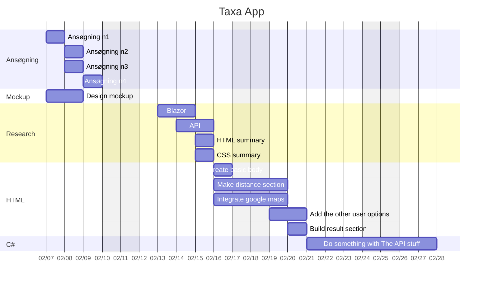

# Gantt diagram

```mermaid

gantt

    title Taxa App

    dateFormat DD-MM-YY

    axisFormat %m/%d

    tickinterval 1day
    excludes weekends


    section Ansøgning

    Ansøgning n1 : 07-02-24, 1d

    Ansøgning n2 : 08-02-24, 1d

    Ansøgning n3 : 08-02-24, 1d

    Ansøgning n4 : 09-02-24, 1d


    section Mockup

    Design mockup : 07-02-24, 2d


    section Research

    Blazor : 13-02-24, 2d

    API : 14-02-24, 2d

    HTML summary: 15-02-24, 1d

    CSS summary: 15-02-24, 1d


    section HTML

    Create basic body : 16-02-24, 1d

    Make distance section : 16-02-24, 2d

    Integrate google maps : 16-02-24, 2d 

    Add the other user options : 19-02-24, 2d

    Build result section : 20-02-24, 1d


    Section C#

    Do something with The API stuff : 21-02-24, 5d
```
