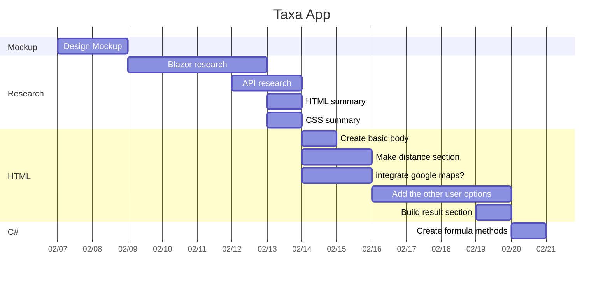

# Gant diagram

```mermaid

gantt

    title Taxa App

    dateFormat DD-MM-YY

    axisFormat %m/%d


    section Mockup

    Design Mockup : 07-02-24, 2d


    section Research

    Blazor research : 09-02-24, 4d

    API research : 12-02-24, 2d

    HTML summary: 13-02-24, 1d

    CSS summary: 13-02-24, 1d


    section HTML

    Create basic body : 14-02-24, 1d

    Make distance section : 14-02-24, 2d

    integrate google maps? : 14-02-24, 2d 

    Add the other user options : 16-02-24, 4d

    Build result section : 19-02-24, 1d


    section C#

    Create formula methods : 20-02-24, 1d

    
    
```
