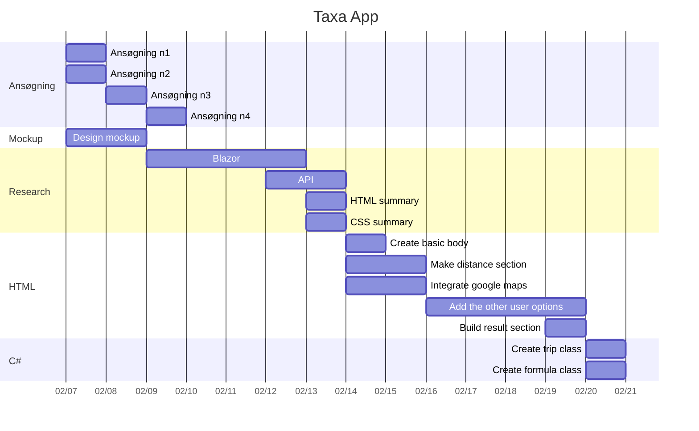

# Gantt diagram

```mermaid

gantt

    title Taxa App

    dateFormat DD-MM-YY

    axisFormat %m/%d

    section Ansøgning

    Ansøgning n1 : 07-02-24, 1d

    Ansøgning n2 : 07-02-24, 1d

    Ansøgning n3 : 08-02-24, 1d

    Ansøgning n4 : 09-02-24, 1d


    section Mockup

    Design mockup : 07-02-24, 2d

    section Research

    Blazor : 09-02-24, 4d

    API : 12-02-24, 2d

    HTML summary: 13-02-24, 1d

    CSS summary: 13-02-24, 1d


    section HTML

    Create basic body : 14-02-24, 1d

    Make distance section : 14-02-24, 2d

    Integrate google maps : 14-02-24, 2d 

    Add the other user options : 16-02-24, 4d

    Build result section : 19-02-24, 1d

 
    section C#

    Create trip class : 20-02-24, 1d

    Create formula class : 20-02-24, 1d
```
