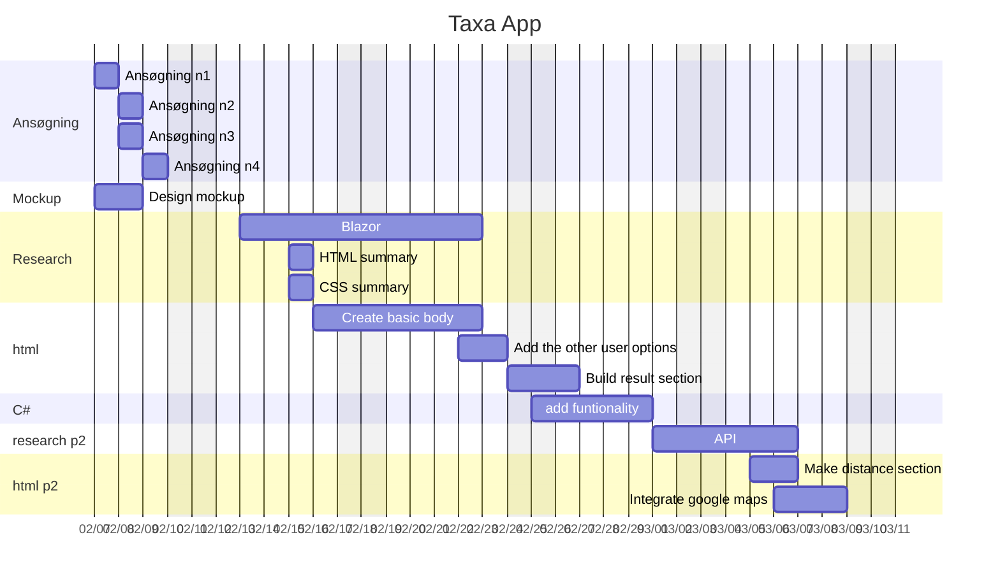

# Gantt diagram

```mermaid

gantt

    title Taxa App

    dateFormat DD-MM-YY

    axisFormat %m/%d

    tickinterval 1day
    excludes weekends


    section Ansøgning

    Ansøgning n1 : 07-02-24, 1d

    Ansøgning n2 : 08-02-24, 1d

    Ansøgning n3 : 08-02-24, 1d

    Ansøgning n4 : 09-02-24, 1d


    section Mockup

    Design mockup : 07-02-24, 2d


    section Research

    Blazor : 13-02-24, 8d

    HTML summary: 15-02-24, 1d

    CSS summary: 15-02-24, 1d


    section html

    Create basic body : 16-02-24, 5d

    Add the other user options : 22-02-24, 2d

    Build result section : 24-02-24, 2d
    

    Section C#

    add funtionality : 25-02-24, 5d


    section research p2

    API : 01-03-24, 4d


    section html p2

    Make distance section : 05-03-24, 2d

    Integrate google maps : 06-03-24, 3d 
```
